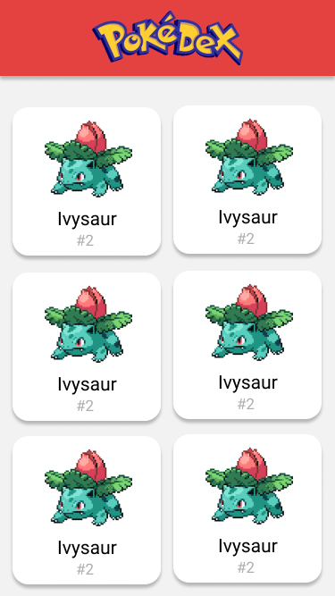
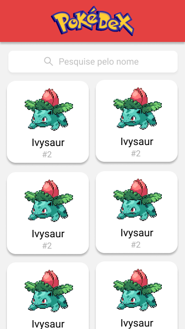

# Projeto #08 - Pokédex

# Descrição

Nessa semana você fará seu primeiro projeto React com dados dinâmicos! Você construirá uma Pokédex como uma Single-Page Application, consumindo uma API pública de Pokémon :)

Repositório de referência: 

# Requisitos

- Geral
    - [ ]  Manipule o HTML usando somente React (sem usar o document nem bibliotecas como jQuery)
    - [ ]  Seu projeto deverá ser desenvolvido utilizando Git e GitHub
    - [ ]  Para isso, comece fazendo um **fork** **privado** do projeto de referência:
    - [ ]  **A cada requisito implementado** faça um commit com uma mensagem descritiva do que você evoluiu. Caso queira dividir um requisito em vários commits, não há problema. Mas evite colocar mais de um requisito no mesmo commit
- Layout
    - [ ]  Aplicar layout para mobile, seguindo imagens fornecida (não é necessário implementar um layout para desktop)
    - [ ]  Topo deve ser fixo
    - [ ]  Hexadecimal do vermelho: #E44141
- Lista de Pokémon
    - [ ]  Ao entrar na página inicial (`"/"`), deverá ser carregada uma lista com todos os Pokémon da API, seguindo o layout fornecido
        - URL da API para buscar todos os Pokémon: [https://pokeapi.co/api/v2/pokemon?limit=893](https://pokeapi.co/api/v2/pokemon?limit=893)
    - [ ]  Enquanto a lista está carregando, deve ser exibida uma mensagem de "Carregando" na tela
    - [ ]  Ao clicar em um Pokémon, o usuário deverá ser encaminhado para a rota `"/pokemon/:id"` em que no lugar de **:id** entre o id do Pokémon conforme retornou da API
        - Dica: a API não retorna o id explicitamente, porém ela retorna uma URL do Pokémon, e o último parâmetro dessa URL é o id. Para pegar somente o id de dentro dessa string, pesquise pelo método `.split()` e quebre essa string a cada barra (`/`)
- Página de um Pokémon
    - [ ]  Ao entrar na página de um Pokémon, deverão ser carregados os dados daquele Pokémon a partir da API e exibidos conforme layout fornecido
        - URL da API para obter um Pokémon: [https://pokeapi.co/api/v2/pokemon/:id](https://pokeapi.co/api/v2/pokemon/:id), onde :id é o id do Pokémon
    - [ ]  Enquanto os dados do Pokémon estão carregando, deve ser exibida uma mensagem de "Carregando" na tela
    - [ ]  Ao clicar em "Voltar", o usuário deve retornar para a página inicial
    - [ ]  Ao clicar em Próximo/Anterior, o usuário deve ser redirecionado para a página referente ao Pokémon correspondente, seguindo a ordem que vem da API
        - Para isso, some/subtraia 1 do id do Pokémon
    - [ ]  Caso o usuário esteja visualizando o primeiro/último Pokémon, trate para não exibir o botão de Próximo/Anterior

# Bônus

- Busca
    - [ ]  Na tela de listagem de Pokémon, implementar uma busca pelo nome do Pokémon
    - [ ]  Essa busca pode ser pelo próprio JS (sem mandar nenhum novo request pra API). Basta filtrar a array de Pokémon exibida, verificando se o nome do Pokémon contém a palavra digitada no campo de busca

# Layout

